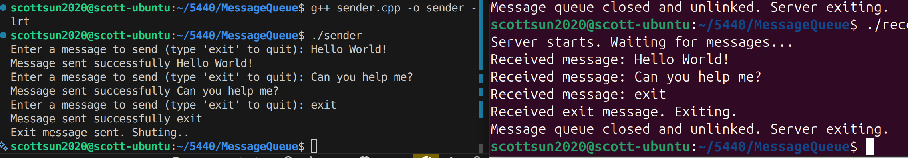

# POSIX Message Queue Example (C++)

This project demonstrates inter-process communication (IPC)
using POSIX message queues on Linux.

## Features

- Two separate programs:
  - sender (client)
  - receiver (server)
- Blocking message queue
- Clean shutdown using "exit" message
- Kernel-based communication

## Requirements

- Linux
- g++
- POSIX message queues
- Link with -lrt

## Compile

g++ sender.cpp -o sender -lrt
g++ receiver.cpp -o receiver -lrt

## Run

Terminal 1:
./receiver

Terminal 2:
./sender

Type messages in sender.
Type "exit" to shut down server.

## How it Works

Sender → Kernel Queue → Receiver

Messages are stored in kernel space and copied
between processes using mq_send() and mq_receive().

## Test 

